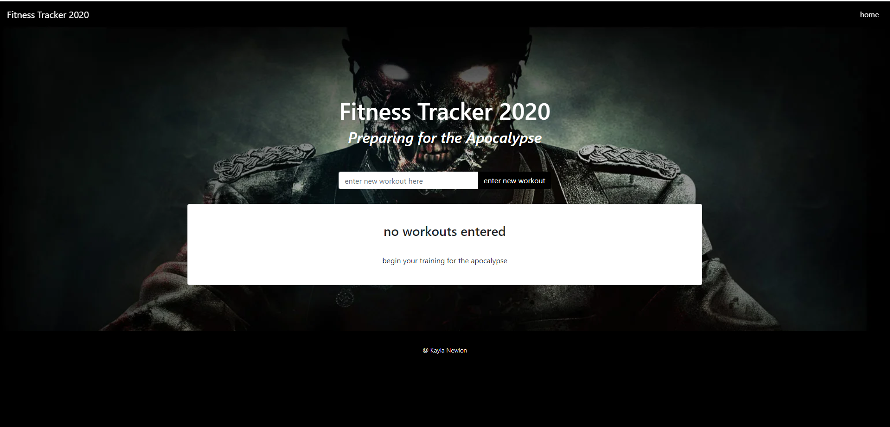
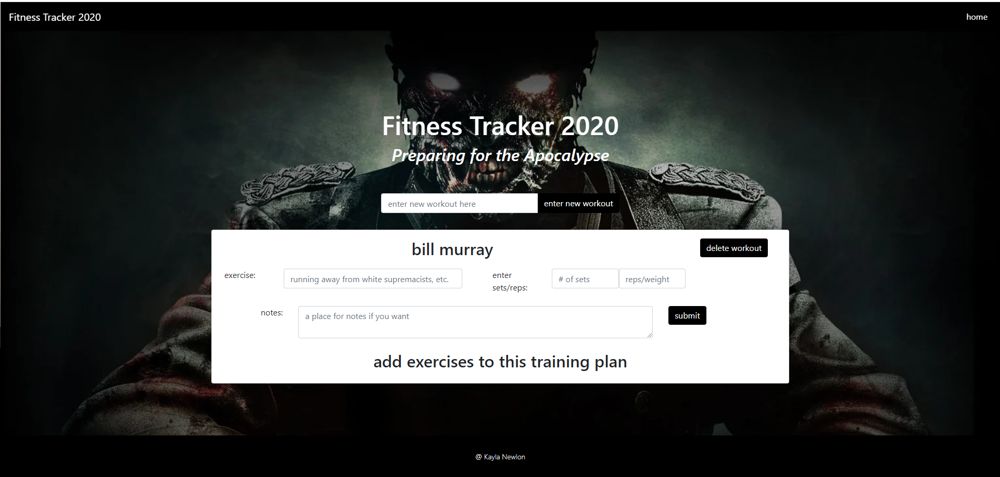
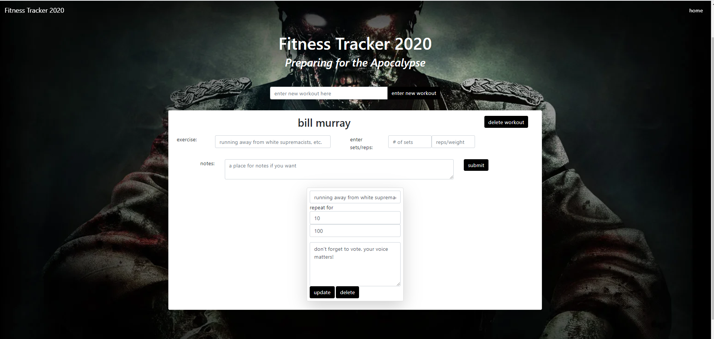

# Fitness Tracker 2020
Use this app to view, create, and track daily workouts to get your ready for the impending apocalypse.

  
## Description 
 Fitness Tracker 2020 uses a Mongo database with a Mongoose schema, routes are handled with Express along with front end connections to the aforementioned routes. Use this application to view, create and track daily workouts. The user can log multiple exercises in a workout on a given day. Fitness Tracker 2020 allows the user to be able to track the name, type, weight, sets, reps, and duration of exercise. If the exercise is a cardio exercise, the user can track the distance traveled. 
  
 "Blessed be our New Founding Fathers and America, a nation reborn. May God be with you all" -The Purge

## Table of Contents 
* [Installation](#Installation)
* [Usage](#Usage)
* [License](#License)
* [Contributing](#Contributing)
* [Tests](#Tests)
* [Visuals](#Visuals)
* [Links](#Links)
* [Questions](#Questions)

## Installation
1. Use 'git clone git@github.com:kbnewlon/workout-tracker.git' to clone the repo
2. Install necessary dependencies with 'npm install'
3. Make sure that you are running 'mongod' in the background to connect to database 
3. Start the program with 'npm start' or 'node server.js'

## Usage
1. Enter new workout at "enter new workout here" field
2. Click 'enter new workout' button to enter new workout 
3. Add different exercises to the workout inclusing sets, reps, weights, and notes pertaining to the workoug
4. Delete workout with 'delete workout' button
5. Prepare for the end of this world with this workout app
6. Enjoy! 

## License
Copyright (c) 2020, Kayla Newlon. (MIT License)

## Contributing 
No guidelines at this time. 

## Tests
Feel free to contact me for any test ideas. 

## Visuals
;
;
;

## Links
To Repo: https://github.com/kbnewlon/workout-tracker
 Visit the deployed app on Heroku to demo: https://preparingfortheapocalypse2020.herokuapp.com/
 

## Questions 
Please contact me if you have any questions at:
 Email: kayla.b.newlon@gmail.com
 Github: https://github.com/kbnewlon